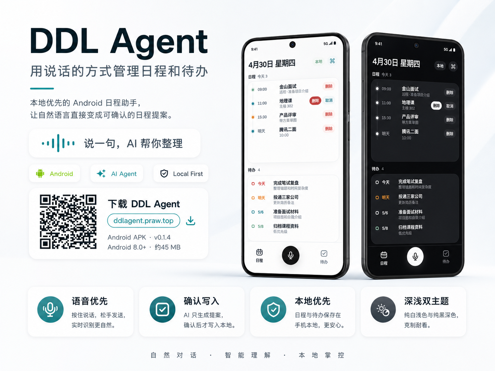
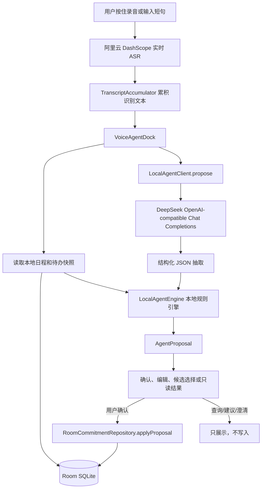

# DDL Agent

用 **说话** 的方式管理日程和待办。

DDL Agent 是一个本地优先的 Android 日程助手。你可以直接说「明天下午三点上地理课」「周五前交作业」「取消下午的会议」，AI 会把自然语言整理成结构化提案，只有在你确认后才写入。

<p>
  <a href="https://github.com/freecodetiger/fucktheddl/releases/latest"><strong>下载 Android APK</strong></a>
  ·
  <a href="https://ddlagent.praw.top">产品页</a>
</p>

<p>
  
</p>

## 核心体验

| 方向 | 说明 |
|---|---|
| 语音优先 | 底部按住说话，松手发送；识别文本会进入 AI 提案流程。 |
| 本地数据 | 日程、待办和任务书存储在手机 Room SQLite，不需要项目后端账号。 |
| 确认写入 | AI 只生成提案，用户确认、编辑或取消后才会写入本地数据。 |
| 自带 Key | 用户在设置中填写自己的 DeepSeek 与阿里云 API Key，费用和调用归用户掌控。 |
| 每日提醒 | 可设置每天一次提醒，只显示当天未过期事项。 |
| 任务书 | 独立的主线/支线目标书架，用树形结构拆解长期追求。 |
| 检查更新 | 在关于页点击版本后，会比对产品页 metadata，并跳转产品发布页或 GitHub Release。 |
| 深浅主题 | 提供克制的浅色主题和纯黑深色主题，贴近 iOS 原生工具感。 |

## 功能

- 自然语言创建、修改、删除、查询日程和待办。
- 长按日程或待办进入编辑卡片。
- 全局创建入口，可手动创建日程或待办；待办支持不设截止日期。
- 模糊删除会返回候选列表，用户选择后再确认。
- 语音输入使用阿里云 DashScope FunASR 实时识别。
- 语音识别会累积停顿前后的文本，避免打断用户思路。
- 支持每天一次本地提醒，提醒内容自动过滤逾期项目。
- 新增任务书分屏，可把长期目标拆成独立树形主线或支线。
- 关于页提供 GitHub 仓库入口和应用内检查更新。

## 架构



任务书模块独立走 Quest Books 数据模型，不接入语音 Agent，也不影响日程、待办统计和每日提醒。

| 环节 | 职责 | 是否写入本地数据 |
|---|---|---|
| 阿里云 ASR | 把语音实时转成文本 | 否 |
| DeepSeek | 把短句抽取为结构化 JSON | 否 |
| LocalAgentEngine | 结合本地事项快照生成提案、候选或查询结果 | 否 |
| 用户确认层 | 展示、编辑、确认或取消提案 | 否 |
| RoomCommitmentRepository | 执行已确认的创建、修改、删除 | 是 |

## 技术栈

| 层 | 技术 |
|---|---|
| Android | Kotlin / Jetpack Compose / Material3 / Room |
| 模型 | DeepSeek，默认 `deepseek-v4-flash` |
| 语音 | 阿里云 DashScope FunASR 实时语音识别 |
| 检查更新 | `https://ddlagent.praw.top/version.json` metadata |
| 发布 | GitHub Actions 自动构建 APK 和 GitHub Release |

## 快速开始

### Android

```bash
git clone https://github.com/freecodetiger/fucktheddl.git
cd fucktheddl
./gradlew assembleDebug
```

Debug APK 输出位置：

```text
app/build/outputs/apk/debug/DDLAgent-v0.2.3.apk
```

Release APK 输出位置：

```text
app/build/outputs/apk/release/DDLAgent-v0.2.3.apk
```

## 应用内配置

用户首次使用前，在应用设置里填写自己的服务配置：

| 配置 | 说明 | 默认值 |
|---|---|---|
| DeepSeek API Key | 用于自然语言解析 | - |
| DeepSeek URL | OpenAI-compatible API 地址 | `https://api.deepseek.com/v1` |
| DeepSeek 模型 | 模型名称 | `deepseek-v4-flash` |
| 阿里云语音 API Key | 用于 DashScope 实时 ASR | - |
| 阿里云语音 URL | 实时语音识别 WebSocket 地址 | `wss://dashscope.aliyuncs.com/api-ws/v1/inference` |

## 项目结构

```text
app/                             Android 客户端
  src/main/java/com/zpc/fucktheddl/
    agent/                       本地 Agent 与 API 模型
    commitments/room/            Room 本地持久化
    notifications/               每日提醒与通知
    quests/                      任务书与目标树
    updates/                     应用内检查更新
    ui/                          Compose UI
    voice/                       实时 ASR 客户端
docs/                            文档与展示资源
prototype/                       Web 原型
```

## 验证

```bash
./gradlew :app:testDebugUnitTest
./gradlew :app:assembleRelease
```

## License

MIT
